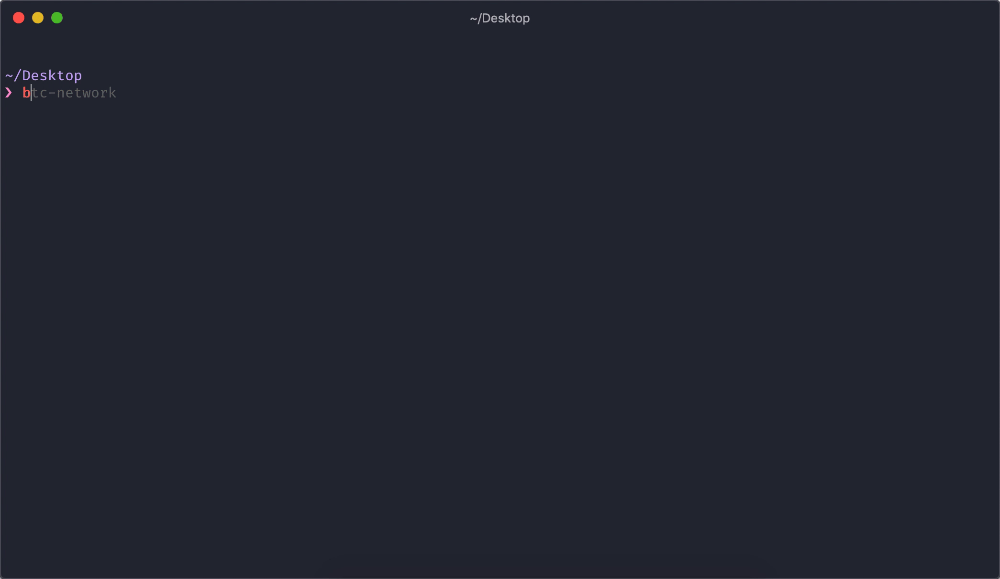

# btc-network

> Tiny module that creates a btc network using docker images

[](https://cloud.docker.com/repository/docker/iamnapo/btc-network)
[](https://github.com/iamnapo/btc-network/actions)
[](https://www.npmjs.com/package/@iamnapo/btc-network)
[](./LICENSE)

## Install

1. If you don't have [Docker](https://www.docker.com/), install it:

   ```sh
   curl -fsSL https://get.docker.com -o get-docker.sh
   sh get-docker.sh
   ```

2. If you don't have [Node.js](https://nodejs.org/en/), install it:

   ```sh
   $ curl -o- https://raw.githubusercontent.com/nvm-sh/nvm/v0.35.0/install.sh | bash
   $ export NVM_DIR="$([ -z "${XDG_CONFIG_HOME-}" ] && printf %s "${HOME}/.nvm" || printf %s "${XDG_CONFIG_HOME}/nvm")"
   		[ -s "$NVM_DIR/nvm.sh" ] && \. "$NVM_DIR/nvm.sh"
   $ nvm i "lts/*"
   ```

3. Install `btc-network` globally:

   ```sh
   $ npm i @iamnapo/btc-network -g
   ```

**_Note:_** If you want a one-liner to do all of the above:

   ```sh
   $ curl -o- https://raw.githubusercontent.com/iamnapo/btc-network/master/install.sh | bash
   ```

**_Note:_** If you don't want to use node/npm, you can [download the corresponding binary](https://github.com/iamnapo/btc-network/releases/latest). Keep in mind that Docker is still required.

## Usage

**WARNING:** Check the files in [`templates/`](./templates) for the required input structure.



## License

MIT © [Napoleon-Christos Oikonomou](https://iamnapo.me)
