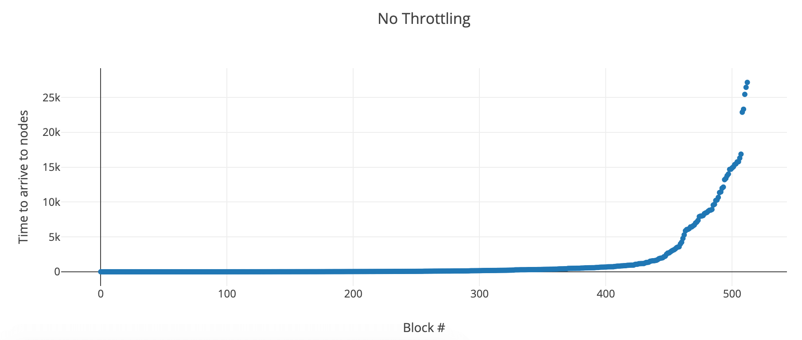
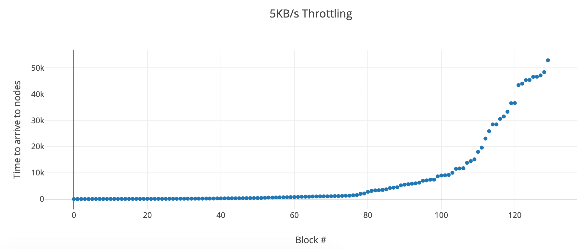

# Block Arrival Time (Using a network with 4 full nodes)

> Note: I used [`trickle`](https://linux.die.net/man/1/trickle) to throttle bandwidth.

| metric | no throttle |      5KB/s up/down |         1KB/s up/down |
| :----- | :---------: | -----------------: | --------------------: |
| min    |    0 ms     |                  0 |                     0 |
| max    |    27 s     |    53 s (+**96%**) | 20.3 min (+**4411%**) |
| mean   |   1.46 s    |  5.3 s (+**263%**) | 5.6 min (+**22914%**) |
| median |    81 ms    | 197 ms (+**143%**) |  53.6 s (+**66073%**) |
| std    |    3.9 s    | 11.8 s (+**203%**) |   7 min (+**10670%**) |

> Data used available [here](./block-dbs.zip).
